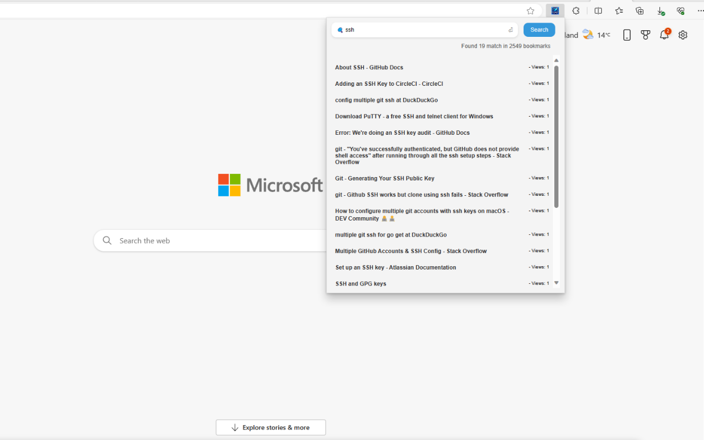

# BookmarkBlitz
Web browser extension - Effortlessly organized, lightning-fast access to your bookmarks.

The power of **Bookmark Blitz**: Simplify bookmark navigation in Microsoft Edge! Swiftly find bookmarks in large sets and track usage with our extension. Enhance your browsing with efficient management and insights.

## To users

🚀 **Dear Valued User,**

I hope you're enjoying **Bookmark Blitz**! 🌟 As a developer, your experience and feedback mean the world to me. Your insights help me enhance and refine the extension to better meet your needs.

If **Bookmark Blitz** has made your browsing experience more seamless or added value to your tasks, would you consider taking a moment to share your thoughts? Your review not only fuels my motivation but also assists fellow users in discovering the benefits of our extension.

🌈 **Why Your Review Matters:**

- **Community Building:** Join the growing community and share your experience.
- **Feedback Loop:** Your insights guide future updates and improvements.
- **Help Others:** Your review helps others discover a tool that could make their browsing better.  

📝 **How to Leave a Review:**

- Visit the Web Store page that matches your browser shown in the previous section.  
- Find the "Reviews" section.
- Click on "Write a review" and share your thoughts!

If you prefer to provide feedback without writing a review, I also welcome your thoughts through the [Feedback Form](https://forms.gle/P4E8rqMzWwjvq6EY9). Your input is invaluable, and we appreciate you helping us make **Bookmark Blitz** even better.

Thank you for being a part of the **Bookmark Blitz** journey. Together, let's make browsing better for everyone!

Best Regards,

## Browser Support

| Browser | Supported | Installation |
| :---: | :---: | :---: |
| Microsoft Edge | :white_check_mark: | [Microsoft Edge Store](https://microsoftedge.microsoft.com/addons/detail/bookmark-blitz/naemcogpihadehmpigkjkifaaphkaldc) |
| Google Chrome | :white_check_mark: | [Chrome Web Store](https://chromewebstore.google.com/detail/bookmark-blitz/clcdagfjmabhoblkfoohhignmlijcpfo?hl=en-US&utm_source=ext_sidebar) |
| Safari | :black_square_button: | |
| Firefox | :black_square_button: | |
| Opera | Coming soon | |
| Brave | Coming soon | |

## Support Languages

| Language | Supported |
| :---: | :---: |
| English | :white_check_mark: |
| Chinese (China) | :white_check_mark: |
| Chinese (TaiWan) | :white_check_mark: |
| Arabic | :white_check_mark: |
| German | :white_check_mark: |
| French | :white_check_mark: |
| Japanese | :white_check_mark: |
| Korean | :white_check_mark: |

## Features 

## Releases

Link: [Relase note](release.md)

